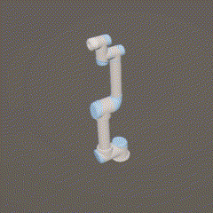

⁹# UR5_Unity
<p align="center">
  
  
  
</p>

**Numerical IK로 생성한 UR5 로봇의 Trajectory를  Unity에서 실시간 시각화**하는 프로젝트입니다.  
Python에서 생성한 trajectory를 JSON 형식으로 전송하면, Unity에서 해당 데이터를 수신하여 UR5 3D 모델이 움직입니다.

---

## 🛠 주요 기능

- UR5 3D 모델 기반 Unity 시뮬레이션
- Python에서 수치 역기구학으로 생성한 trajectory(JSON) 송신
- TCP Socket 기반 실시간 통신
- 수신된 데이터를 기반으로 Unity 내 로봇 동작

---

## 🛠️ 실행 환경

* Python 3.9
* `numpy`, `scipy`, `matplotlib`, `pyqt5'

```bash
pip install numpy scipy matplotlib pyqt pyqt5-tools
```
---

## 🔧 시스템 구조

```text
[Python Script] ──> (Socket, JSON) ──> [Unity]
```
---

## 🚀 실행 방법
UR5_RUN 폴더 내에 Unity Bulid UR5 실행   
python 실행 전 까지 TCP 수신 대기

pythonControl 폴더 내 qt_test.py 실행
pose, jointangle 슬라이더 조정하여 자세 저장
실행 시 순서대로 Numerical IK 계산 후 trajectory 생성
UR5 오브젝트 실시간 동작 확인

---

## 📌 추가 예정

qt GUI 종료해도 저장한 경로 값 초기화 되지 않도록 SQLite DB파일로 trajectory 데이터 저장
query로 trajectory 불러와서 반영하도록 개선해야 함(IK를 매번 연산하면 CPU 과부하 발생)
Reset 버튼 추가해서 프로그램 리셋 기능 구현 예정
pyinstaller로 최종 exe 파일 Build

---

## 🔗 License

MIT License. Free to use, modify, and learn from.

---
